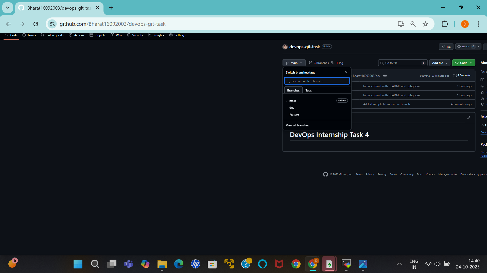
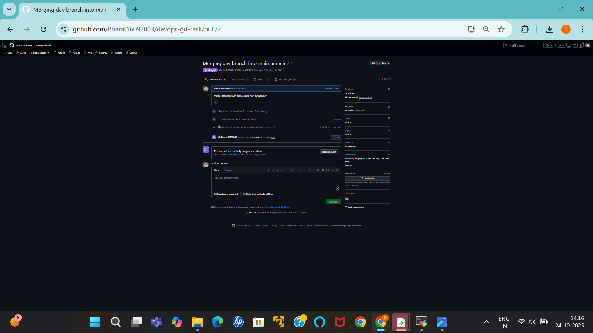
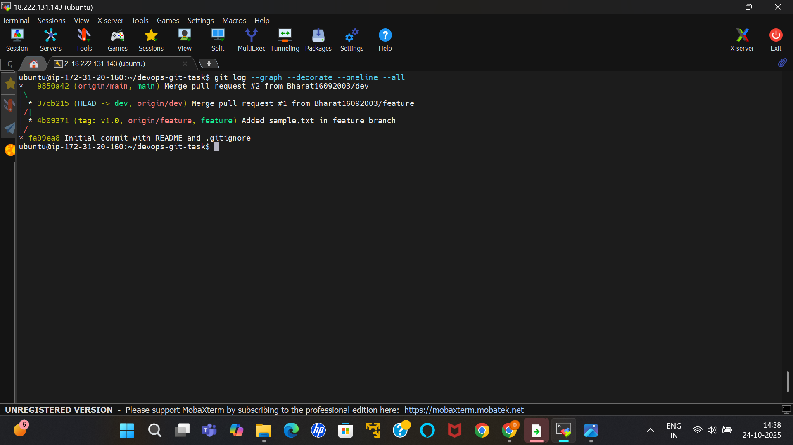

# 🚀 DevOps Internship – Task 4: Git Version Control Project

## 🎯 Objective

To manage a DevOps project using **Git best practices** — including branching, commits, pull requests, and tags — and document everything in **Markdown**.

---

## 🧰 Tools Used

* Git – Version control tool
* GitHub – Remote repository hosting platform

---

## 🏗️ Project Setup

### 1️⃣ Initialize Repository

```bash
git init
git remote add origin <your-repo-url>
```

### 2️⃣ Create Essential Files

```bash
touch README.md .gitignore
echo "# DevOps Internship Task 4" > README.md
```

### 3️⃣ Create and Push Branches

```bash
git branch dev
git branch feature
git push origin main
git push origin dev
git push origin feature
```

---

## 🌿 Branching Strategy

| Branch  | Purpose                                           |
| ------- | ------------------------------------------------- |
| main    | Production-ready / final branch                   |
| dev     | Development and testing branch                    |
| feature | Used to build and test new changes before merging |

---

## 🔁 Workflow Steps

1. Make changes on the feature branch.
2. Commit your changes with a clear message:

   ```bash
   git add .
   git commit -m "Added new feature or update"
   ```
3. Push the branch to GitHub:

   ```bash
   git push origin feature
   ```
4. Create a Pull Request (PR) on GitHub from `feature → dev`.
5. After review, merge dev → main using another PR.
6. This simulates a real-world DevOps Git workflow.

---

## 🏷️ Tagging

Create tags to mark project versions:

```bash
git tag v1.0
git push origin v1.0
```

| Tag    | Description                         |
| ------ | ----------------------------------- |
| `v1.0` | First completed version of the task |

---

## 🚫 .gitignore Example

```
*.log
.env
__pycache__/
node_modules/
```

This ensures unwanted files are not tracked by Git.

---

## 📂 Recommended Folder Structure

```
devops-git-project/
├── README.md
├── .gitignore
├── screenshots/
│   ├── branches.png
│   ├── pull-request.png
│   └── merge-history.png
└── sample.txt
```


---

## 🖼️ Screenshots Section

```markdown




```

---

## ✅ Outcome

* Created and managed Git branches (`main`, `dev`, `feature`)
* Practiced pull requests and merging
* Used `.gitignore` and Git tags
* Documented all steps in Markdown format
* Learned practical Git workflow for DevOps

---

Author:Bharat Singh
Internship:DevOps Internship – Task 4
